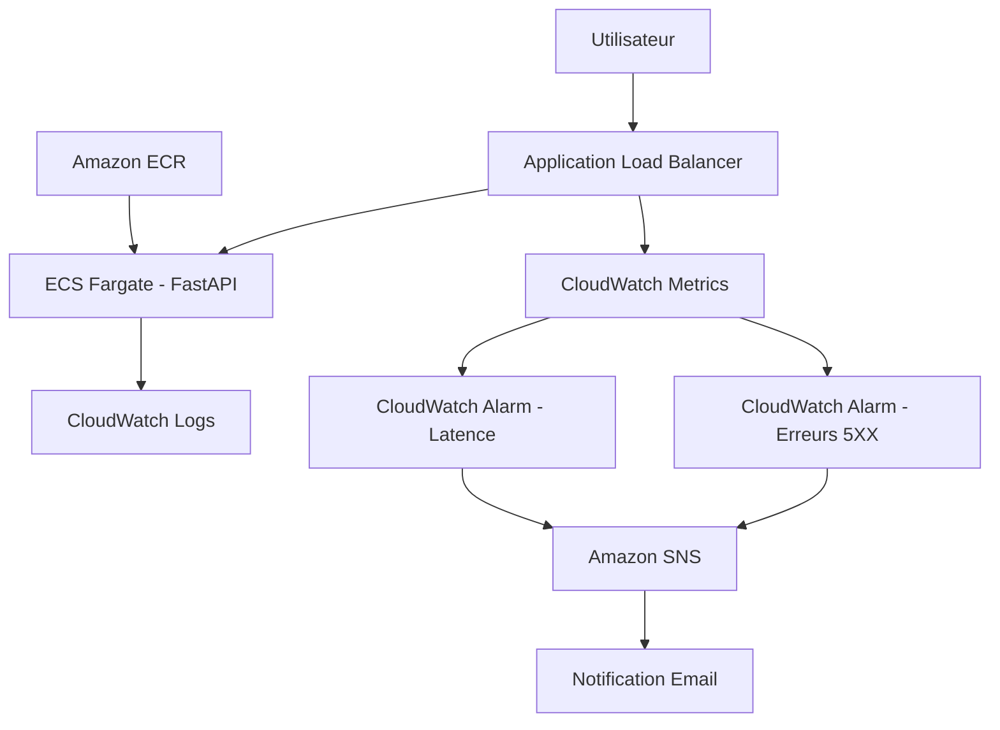

# Cloud Incident Project

Infrastructure Cloud/DevOps orientée observabilité permettant de déployer une API conteneurisée sur AWS, détecter automatiquement des incidents applicatifs et déclencher des alertes en temps réel.

Le projet est développé dans une logique d'apprentissage pratique autour du Cloud, du DevOps et de la sécurité, avec une approche centrée sur le débogage réel et l'infrastructure as code.

---

## Aperçu

Objectifs du projet :

- Déployer une API conteneurisée sur AWS
- Mettre en place une infrastructure modulaire avec Terraform
- Détecter automatiquement les erreurs et anomalies
- Déclencher des alertes en temps réel
- Documenter le troubleshooting et les incidents

---

## Architecture



---

## Stack technique

| Catégorie | Technologies |
|---|---|
| Backend | FastAPI |
| Conteneurisation | Docker |
| Tests | Pytest |
| Infrastructure as Code | Terraform |
| Cloud Provider | AWS |
| Registry | Amazon ECR |
| Compute | ECS Fargate |
| Réseau | VPC + ALB |
| Monitoring | CloudWatch |
| Notifications | SNS |
| CI | GitHub Actions |

---

## Fonctionnalités actuelles

### API

Endpoints disponibles :

```http
GET /health
GET /api/error
GET /api/slow
```

Fonctionnement :

- `/health`

Retourne :

```json
{"status":"ok"}
```

- `/api/error`

Simule :

```text
Erreur HTTP 500
```

- `/api/slow`

Simule :

```text
Latence importante
```

---

### Infrastructure AWS

Infrastructure actuellement déployée :

- VPC
- Subnets publics / privés
- Routage réseau
- ECS Fargate
- Application Load Balancer
- ECR privé
- IAM Roles
- CloudWatch Logs
- CloudWatch Alarms
- SNS Email

---

### Observabilité

Métriques surveillées :

- erreurs HTTP 5XX
- temps de réponse

Alertes :

- CloudWatch Alarm erreurs
- CloudWatch Alarm latence
- Notification SNS Email

---

### Validation réelle

Tests réalisés :

- Déploiement ECS validé
- Health checks validés
- Incident 5XX simulé
- Latence simulée
- Réception email SNS validée
- Logs CloudWatch validés
- Destruction Terraform validée

---

## Structure du projet

```text
Cloud-Incident-Projet/
│
├── app/
│   ├── api/
│   └── models/
│
├── tests/
│
├── docs/
│   ├── architecture.md
│   ├── debug-journal.md
│   ├── runbook-incident-5xx.md
│   └── screenshots/
│
├── infra/
│   ├── bootstrap/
│   ├── envs/
│   │   └── dev/
│   │
│   └── modules/
│       ├── vpc/
│       ├── ecr/
│       ├── ecs/
│       └── monitoring/
│
├── Dockerfile
├── docker-compose.yml
├── requirements.txt
├── README.md
└── .github/
    └── workflows/
```

---

## Documentation

| Document | Description |
|---|---|
| docs/architecture.md | Architecture détaillée |
| docs/debug-journal.md | Journal des problèmes rencontrés et résolutions |
| docs/runbook-incident-5xx.md | Procédure de gestion d'incident |
| docs/screenshots/ | Captures des validations |

---

## Captures

### CloudWatch Alarm

Ajouter capture :

```text
docs/screenshots/cloudwatch-alarm.png
```

---

### Notification SNS

Ajouter capture :

```text
docs/screenshots/sns-alert.png
```

---

### GitHub Actions CI

Ajouter capture :

```text
docs/screenshots/github-actions.png
```

---

## Exécution locale

Cloner le projet :

```bash
git clone https://github.com/labosnie/Cloud-Incident-Projet.git

cd Cloud-Incident-Projet
```

Lancer localement :

```bash
docker-compose up --build
```

Tester :

```bash
curl http://localhost:8000/health
```

Résultat attendu :

```json
{"status":"ok"}
```

---

## Pipeline CI actuel

Pipeline GitHub Actions :

Étapes exécutées :

1. Checkout repository
2. Installation dépendances
3. Lint
4. Tests Pytest
5. Build Docker

Objectif :

Garantir qu'une modification n'introduit pas une régression avant déploiement.

---

## Roadmap

Court terme :

- [ ] Ajouter un exemple de post-mortem
- [ ] Ajouter estimation des coûts
- [ ] Ajouter Trivy pour le scan Docker

Moyen terme :

- [ ] Déploiement automatique ECS
- [ ] RDS PostgreSQL privé
- [ ] Secrets Manager
- [ ] HTTPS avec ACM

Long terme :

- [ ] WAF
- [ ] OpenTelemetry
- [ ] Tracing distribué
- [ ] Séparation dev / staging / production

---

## Leçons apprises

Problèmes rencontrés durant le développement :

- Différence entre ECS et ECR
- Gestion des images Docker privées
- Diagnostic d'erreurs ALB 503
- Importance des health checks
- Débogage CloudWatch
- Gestion des métriques ALB
- Dépendances Terraform destroy
- Débogage réseau AWS
- Importance de documenter les incidents

Les détails sont disponibles ici :

`docs/debug-journal.md`

---

## Auteur

Projet développé dans le cadre d'une montée en compétences Cloud / DevOps / Sécurité.

L'objectif est de construire progressivement une architecture réaliste tout en documentant les problèmes rencontrés et les solutions apportées.