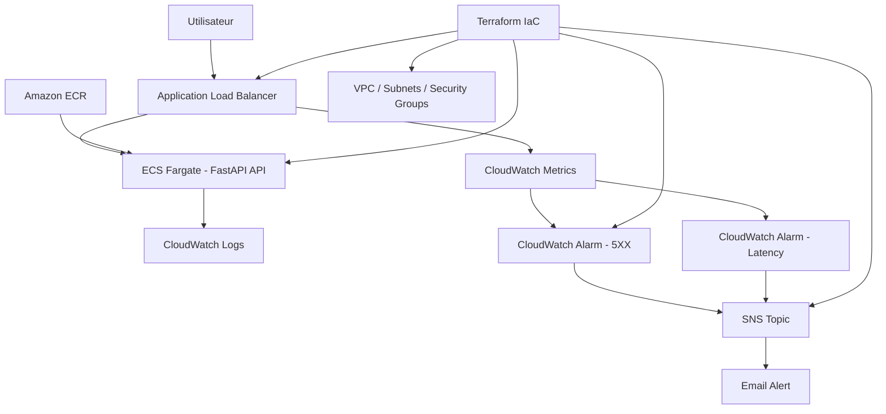

# Cloud Incident Project

Projet personnel **Cloud / DevOps / Sécurité** visant à déployer, superviser et documenter une API FastAPI conteneurisée sur AWS.

L’objectif est de construire une mini-plateforme d’**incident detection** capable de :

- déployer une API conteneurisée sur AWS ;
- exposer l’application via un Application Load Balancer ;
- simuler des erreurs applicatives ;
- détecter ces erreurs avec Amazon CloudWatch ;
- déclencher une alerte email via Amazon SNS ;
- documenter les problèmes rencontrés et le raisonnement de debug.

> Ce projet est une architecture de démonstration orientée apprentissage et portfolio.  
> Il n’est pas présenté comme une architecture de production complète.

---

## Objectif du projet

Ce projet a pour but de montrer une progression concrète vers un profil **Cloud / DevOps / Sécurité junior**.

Il permet de pratiquer plusieurs compétences importantes :

- développement d’une API avec FastAPI ;
- conteneurisation avec Docker ;
- infrastructure as code avec Terraform ;
- déploiement sur AWS ECS Fargate ;
- stockage d’image Docker dans Amazon ECR ;
- exposition via Application Load Balancer ;
- monitoring avec CloudWatch ;
- alerting avec SNS ;
- diagnostic d’incidents ;
- documentation technique ;
- gestion des coûts en détruisant l’infrastructure après test.

---

## Runbook incident

Une procédure d’investigation est disponible pour les incidents HTTP 5XX détectés via CloudWatch.

Lire le document :

[Runbook — Incident HTTP 5XX](docs/runbook-incident-5xx.md)

## Architecture actuelle

L’architecture validée actuellement est volontairement simple et orientée démonstration low-cost.

```text
Utilisateur
   |
   v
Application Load Balancer
   |
   v
ECS Fargate - API FastAPI
   |
   v
CloudWatch Logs

Application Load Balancer
   |
   v
CloudWatch Metrics
   |
   v
CloudWatch Alarm
   |
   v
SNS Topic
   |
   v
Email Alert
```

Version Mermaid :



---

## Stack technique

| Domaine | Technologies |
|---|---|
| Backend | Python, FastAPI |
| API docs | Swagger UI |
| Base locale | PostgreSQL via Docker Compose |
| Conteneurisation | Docker, Docker Compose |
| Tests | Pytest |
| Infrastructure as Code | Terraform |
| Cloud provider | AWS |
| Registry Docker | Amazon ECR |
| Compute | AWS ECS Fargate |
| Load balancing | Application Load Balancer |
| Logs | Amazon CloudWatch Logs |
| Metrics & alerting | Amazon CloudWatch Alarms |
| Notifications | Amazon SNS |
| Debug / Ops | AWS CLI, PowerShell, CloudWatch, ECS Events |

---

## Fonctionnalités de l’API

| Méthode | Endpoint | Description |
|---|---|---|
| `GET` | `/health` | Vérifie l’état de santé de l’application |
| `GET` | `/api/orders` | Liste des commandes fictives |
| `POST` | `/api/orders` | Création d’une commande fictive |
| `GET` | `/api/error` | Simulation d’une erreur serveur pour tester l’alerting |
| `GET` | `/api/slow` | Simulation d’une latence applicative |

Documentation interactive locale :

```text
http://localhost:8000/docs
```

---

## État d’avancement

- [x] API FastAPI locale
- [x] Endpoints de test : `/health`, `/api/slow`, `/api/error`
- [x] Dockerfile
- [x] Docker Compose local avec PostgreSQL
- [x] Tests Pytest de base
- [x] Terraform — VPC, subnets publics/privés, routage
- [x] Amazon ECR — registry Docker privé
- [x] AWS ECS Fargate — déploiement de l’API
- [x] Application Load Balancer avec health check `/health`
- [x] CloudWatch Log Group
- [x] CloudWatch Alarm sur erreurs 5XX
- [x] CloudWatch Alarm sur latence
- [x] Amazon SNS — alerte email
- [x] Validation réelle d’un incident simulé
- [x] Debug journal
- [x] Runbook incident 5XX
- [ ] Post-mortem d’exemple
- [x] GitHub Actions CI (lint, tests, build Docker)
- [ ] GitHub Actions CD (push ECR / déploiement ECS)
- [ ] RDS PostgreSQL privé + Secrets Manager / SSM
- [ ] Durcissement sécurité Docker/IAM
- [ ] Schéma d’architecture production-ready
- [ ] HTTPS avec ACM
- [ ] VPC Endpoints ou NAT Gateway selon scénario cible

---

## Structure du dépôt

```text
.
├── app/                       # Code FastAPI
├── tests/                     # Tests Pytest
├── infra/                     # Infrastructure Terraform
│   ├── bootstrap/             # Préparation éventuelle du backend Terraform
│   ├── envs/
│   │   └── dev/               # Environnement de développement
│   └── modules/
│       ├── vpc/               # Réseau AWS
│       ├── ecr/               # Registry Docker
│       ├── ecs/               # ECS Fargate + ALB
│       └── monitoring/        # CloudWatch Alarms + SNS
├── docs/                      # Documentation et preuves de validation
│   ├── debug-journal.md       # Journal de debug détaillé
│   ├── CLOUDWATCH ALARM.png
│   ├── HTTP 500 REQUEST.png
│   └── MAIL SNS ALARM.png
├── Dockerfile
├── docker-compose.yml
├── .github/
│   └── workflows/
│       └── ci.yml             # Pipeline CI GitHub Actions
├── requirements.txt           # Dépendances runtime (API + Docker)
├── requirements-dev.txt       # Lint, format, tests (local + CI)
├── pytest.ini
├── .flake8
├── pyproject.toml             # Configuration Black
├── .env.example
├── .gitignore
└── README.md
```

---

## Démarrage local

### Prérequis

- Python 3.11+
- Docker Desktop
- Git
- PowerShell ou terminal équivalent

### 1. Cloner le dépôt

```powershell
git clone https://github.com/labosnie/Cloud-Incident-Projet.git
cd Cloud-Incident-Projet
```

### 2. Créer le fichier d’environnement

Ne jamais committer de secrets.

```powershell
Copy-Item .env.example .env
```

Adapter ensuite les variables si nécessaire.

### 3. Lancer l’environnement Python

```powershell
python -m venv .venv
.\.venv\Scripts\Activate.ps1
pip install -r requirements-dev.txt
```

> `requirements.txt` sert au runtime (Docker / production).  
> `requirements-dev.txt` ajoute flake8, black et pytest pour le développement et la CI.

### 4. Lancer les tests

```powershell
pytest -v
```

### 4 bis. Lancer le lint et le format en local (comme en CI)

```powershell
flake8 app tests
black --check app tests
```

Corriger le format automatiquement :

```powershell
black app tests
```

### 5. Lancer avec Docker Compose

```powershell
docker compose up --build
```

Accès à Swagger UI :

```text
http://localhost:8000/docs
```

Arrêter les containers :

```powershell
docker compose down
```

Supprimer aussi les données PostgreSQL locales :

```powershell
docker compose down -v
```

---

## CI GitHub Actions

Une première pipeline **CI** (sans CD) valide chaque push et chaque pull request sur `main` / `master`.

### Flux

```text
Push / Pull Request
        |
        v
   GitHub Actions (ubuntu-latest)
        |
        +-- Checkout
        +-- Python 3.13 + cache pip
        +-- pip install -r requirements-dev.txt
        +-- flake8 app tests
        +-- black --check app tests
        +-- pytest -v
        +-- docker build
```

Fichier workflow : [`.github/workflows/ci.yml`](.github/workflows/ci.yml)

### Vérifier en local avant de pousser

```powershell
pip install -r requirements-dev.txt
flake8 app tests
black --check app tests
pytest -v
docker build -t cloud-incident-api:local .
```

### Captures utiles pour le portfolio

Après un push sur GitHub, documenter dans `docs/` (ou lier depuis le README) :

| Capture | Où la prendre | Ce qu’elle prouve |
|---|---|---|
| Workflow en cours | Repo → **Actions** → run **CI** | La CI se déclenche bien |
| Toutes les étapes vertes | Détail du run → jobs / steps | Lint, tests et build Docker passent |
| Logs pytest | Step **Tests (pytest)** | Les 5 tests passent en environnement propre |
| Build Docker | Step **Build Docker** | L’image se construit comme en local |

Exemple de nom de fichier : `docs/GITHUB-ACTIONS-CI-SUCCESS.png`

### Erreurs fréquentes

| Symptôme | Cause probable | Correction |
|---|---|---|
| `ModuleNotFoundError: fastapi` | `requirements-dev.txt` non installé | `pip install -r requirements-dev.txt` |
| flake8 échoue | style ou import inutilisé | lire la ligne signalée, corriger le fichier |
| `black --check` échoue | format non appliqué | `black app tests` puis recommit |
| pytest OK en local, KO en CI | version Python différente | aligner sur **3.13** (comme le `Dockerfile`) |
| `docker build` KO en CI | `Dockerfile` ou `requirements.txt` invalide | reproduire `docker build .` en local |

---

## Déploiement AWS avec Terraform

L’infrastructure AWS est gérée avec Terraform depuis l’environnement :

```text
infra/envs/dev
```

### Commandes principales

```powershell
cd infra/envs/dev
terraform init
terraform validate
terraform plan
terraform apply
```

Après déploiement, récupérer le DNS de l’ALB :

```powershell
terraform output alb_dns_name
```

Tester le endpoint de santé :

```powershell
curl.exe http://<alb_dns>/health
```

Résultat attendu :

```json
{"status":"ok"}
```

### Destruction de l’infrastructure

Pour éviter les coûts inutiles, l’infrastructure de démonstration est détruite après les tests :

```powershell
terraform destroy
```

---

## Démo de détection d’incident et d’alerte

Ce projet inclut un workflow de détection d’incident basé sur **Amazon CloudWatch** et **Amazon SNS**.

L’objectif est de simuler un incident applicatif, de le détecter automatiquement avec CloudWatch, puis d’envoyer une alerte email via SNS.

### Scénario testé

L’application FastAPI expose un endpoint dédié à la simulation d’erreurs serveur :

```http
GET /api/error
```

Lorsque cet endpoint est appelé plusieurs fois, l’Application Load Balancer reçoit des réponses HTTP 500 depuis la tâche ECS Fargate.

### Détection avec CloudWatch

CloudWatch surveille la métrique suivante de l’Application Load Balancer :

```text
HTTPCode_Target_5XX_Count
```

Lorsque le nombre d’erreurs 5XX dépasse le seuil configuré, l’alarme CloudWatch passe de l’état `OK` à l’état `ALARM`.

### Notification avec SNS

Lorsque l’alarme passe en état `ALARM`, CloudWatch déclenche un topic Amazon SNS.

Le topic SNS envoie ensuite une notification email au destinataire configuré.

### Commande utilisée pour simuler l’incident

```powershell
$albDns = aws elbv2 describe-load-balancers --names cloudops-incident-dev-alb --region eu-west-3 --query "LoadBalancers[0].DNSName" --output text
$alb = "http://$albDns"

1..30 | ForEach-Object {
  curl.exe -s -o NUL -w "req $_ -> HTTP %{http_code}`n" "$alb/api/error"
  Start-Sleep -Seconds 5
}
```

### Preuves de validation

#### 1. Génération d’erreurs HTTP 500 depuis PowerShell


#### 2. Alarme CloudWatch déclenchée


#### 3. Email d’alerte reçu via SNS


### Résultat

Le workflow de détection d’incident a été validé avec succès :

```text
/api/error
→ ALB reçoit des réponses HTTP 500
→ CloudWatch détecte les erreurs 5XX
→ L’alarme passe en ALARM
→ SNS envoie une notification email
→ L’alerte est reçue avec succès
```

---

## Debug Journal

Un journal de debug est disponible dans le dossier `docs`.

Il documente les principaux problèmes rencontrés pendant la construction du projet :

- confusion entre ECR et ECS ;
- ALB en erreur 503 ;
- image Docker absente dans ECR ;
- Docker Desktop non démarré ;
- erreur de login Docker vers ECR ;
- mauvais topic SNS testé ;
- alarme CloudWatch sans datapoints ;
- mauvaise dimension `TargetGroup` ;
- blocage lors du `terraform destroy` ;
- risque de commit de fichiers sensibles.

Lire le document :

[Debug Journal — Cloud Incident Project](docs/debug-journal.md)

---

## Sécurité

Ce projet applique déjà plusieurs bonnes pratiques de base :

- secrets exclus du dépôt via `.gitignore` ;
- utilisation d’un fichier `.env.example` comme modèle ;
- séparation des modules Terraform ;
- Security Group de l’ALB exposé en HTTP public ;
- Security Group ECS limité au trafic provenant de l’ALB ;
- séparation entre ECS execution role et ECS task role ;
- ECR avec scan d’image activé ;
- pas de RDS public actuellement ;
- destruction de l’infrastructure après test pour réduire l’exposition et les coûts.

### Limites de sécurité assumées

Cette version reste une démonstration low-cost.

Limites actuelles :

- pas encore de HTTPS avec ACM ;
- pas encore de WAF ;
- ECS peut être lancé en subnet public pour éviter le coût d’une NAT Gateway ;
- pas encore de Secrets Manager / SSM pour une base RDS ;
- Dockerfile pas encore durci avec utilisateur non-root ;
- pas encore de CI/CD sécurisé via GitHub OIDC ;
- pas encore de CloudTrail / GuardDuty / Security Hub.

---

## Gestion des coûts

L’infrastructure AWS est utilisée comme environnement de démonstration.

Pour limiter les coûts :

- pas de RDS pour l’instant ;
- pas de NAT Gateway pour l’instant ;
- ECS Fargate avec petite configuration ;
- CloudWatch Logs avec rétention courte ;
- destruction de l’infrastructure après les tests ;
- ECR configuré avec `force_delete = true` en environnement dev pour simplifier le nettoyage.

Commande de nettoyage :

```powershell
cd infra/envs/dev
terraform destroy
```

---

## Limites actuelles

Le projet n’est pas encore production-ready.

Limites connues :

- API métier volontairement simple ;
- données fictives ;
- pas encore de migrations Alembic ;
- pas encore de base RDS managée ;
- pas encore de CI/CD complet ;
- pas encore de stratégie de rollback ;
- pas encore de dashboard CloudWatch complet ;
- pas encore de runbook ou post-mortem formalisé ;
- pas encore de HTTPS.

---

## Roadmap

### Court terme

- [ ] Ajouter un runbook incident 5XX
- [ ] Ajouter un post-mortem d’exemple
- [ ] Nettoyer et enrichir la documentation d’architecture
- [ ] Ajouter un schéma détaillé dans `docs/architecture.md`
- [ ] Ajouter une section estimation des coûts

### Moyen terme

- [x] Ajouter GitHub Actions pour lancer les tests
- [x] Ajouter GitHub Actions pour build l’image Docker
- [ ] Ajouter push automatique vers ECR
- [ ] Ajouter déploiement ECS automatisé
- [ ] Durcir le Dockerfile avec un utilisateur non-root
- [ ] Ajouter scan sécurité dans la CI

### Long terme

- [ ] Ajouter RDS PostgreSQL dans des subnets privés
- [ ] Stocker les secrets dans AWS Secrets Manager ou SSM Parameter Store
- [ ] Ajouter HTTPS avec ACM
- [ ] Ajouter WAF
- [ ] Ajouter CloudTrail / GuardDuty / Security Hub
- [ ] Ajouter VPC Endpoints ou NAT Gateway selon l’architecture cible
- [ ] Ajouter OpenTelemetry
- [ ] Ajouter dashboard CloudWatch complet

---


## Références utiles

- AWS ECS Fargate  
  https://docs.aws.amazon.com/AmazonECS/latest/developerguide/AWS_Fargate.html

- Amazon ECR  
  https://docs.aws.amazon.com/AmazonECR/latest/userguide/what-is-ecr.html

- Application Load Balancer  
  https://docs.aws.amazon.com/elasticloadbalancing/latest/application/introduction.html

- CloudWatch Alarms  
  https://docs.aws.amazon.com/AmazonCloudWatch/latest/monitoring/AlarmThatSendsEmail.html

- Amazon SNS  
  https://docs.aws.amazon.com/sns/latest/dg/welcome.html

- Terraform AWS Provider  
  https://registry.terraform.io/providers/hashicorp/aws/latest/docs

---

## Note méthodologique

Ce projet a été conçu, structuré et réfléchi par moi-même dans le cadre de ma montée en compétence Cloud / DevOps / Sécurité.

L’architecture, les choix techniques et les scénarios d’incident ont été préparés manuellement, notamment à travers des notes et schémas réalisés au cahier.

L’IA a été utilisée comme assistant pédagogique et technique pour clarifier certains concepts, comparer des choix d’architecture, aider au debugging et améliorer la documentation.

La mise en œuvre, les tests, les corrections, les commandes exécutées et la validation finale ont été réalisés progressivement par moi-même.

## Licence

À définir.

Pour un projet portfolio personnel, une licence MIT peut être ajoutée si le projet est destiné à être réutilisable publiquement.