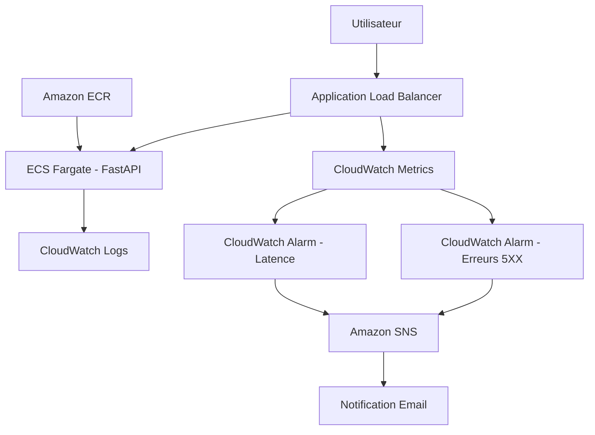

# Cloud Incident Project

Projet portfolio Cloud/DevOps orienté observabilité : API conteneurisée sur AWS, détection d’incidents applicatifs simulés et alertes par e-mail.

Développé dans une logique d’apprentissage pratique (Cloud, DevOps, sécurité), avec infrastructure as code et documentation du débogage réel. **Ce n’est pas une plateforme production-ready** : pas de HTTPS, pas de RDS managé sur AWS, sécurité IaC Checkov en mode avertissement (non bloquant pour l’instant).

---

## Aperçu

Objectifs du projet :

- Déployer une API conteneurisée sur AWS (environnement **dev**)
- Infrastructure modulaire Terraform
- Simuler des erreurs et de la latence pour tester l’alerting
- Documenter troubleshooting, runbooks et post-mortems

---

## État actuel validé

### Infrastructure

- Terraform modulaire (`infra/modules/`, `infra/envs/dev/`, bootstrap S3/DynamoDB)
- VPC (subnets publics / privés, routage)
- Amazon ECR
- ECS Fargate + Application Load Balancer
- CloudWatch Logs
- CloudWatch Alarms (5XX, latence)
- SNS (notification e-mail)

### CI/CD

- GitHub Actions (qualité Python, build, Trivy)
- Terraform CI (`fmt`, `validate`, `tflint`, `checkov` en warning)
- Push automatique image → ECR (branche `main`)
- Redéploiement ECS (`update-service --force-new-deployment`)
- Scan Trivy (CRITICAL bloquant, HIGH en avertissement)
- Authentification AWS via OIDC

### Application & local

- API FastAPI
- Docker + Docker Compose (API + PostgreSQL en local)
- Tests Pytest

### Documentation

- Architecture (`docs/architecture.md`)
- Journal de debug (`docs/debug-journal.md`)
- Runbook incident 5XX (`docs/runbook-incident-5xx.md`)
- Post-mortem exemple (`docs/postmortem-example.md`)
- Estimation des coûts (`docs/cost-estimation.md`)
- Captures de validation incident → alarme → e-mail (`docs/*.png`)

---

## Architecture



---

## Stack technique

| Catégorie | Technologies |
|---|---|
| Backend | FastAPI |
| Conteneurisation | Docker, Docker Compose |
| Tests | Pytest |
| Infrastructure as Code | Terraform |
| Cloud Provider | AWS |
| Registry | Amazon ECR |
| Compute | ECS Fargate |
| Réseau | VPC + ALB |
| Monitoring | CloudWatch Logs, CloudWatch Alarms |
| Notifications | SNS (e-mail) |
| CI/CD | GitHub Actions, Trivy, Terraform CI (TFLint, Checkov) |

---

## Fonctionnalités actuelles

### API

Endpoints principaux :

```http
GET  /health
GET  /api/orders
POST /api/orders
GET  /api/error
GET  /api/slow
```

| Route | Rôle |
|---|---|
| `/health` | Santé pour ALB / tests (`{"status":"ok"}`) |
| `/api/orders` | CRUD commandes (démo métier) |
| `/api/error` | Erreur HTTP 500 simulée (tests alerting) |
| `/api/slow` | Latence ~5 s simulée (tests alerting) |

**Données :** en local, Docker Compose utilise **PostgreSQL**. Sur AWS (dev), la tâche ECS utilise **SQLite** (`/tmp/orders.db`) — pas de RDS déployé pour l’instant.

---

### Infrastructure AWS (dev)

Déployée via Terraform (`infra/envs/dev/`) :

- VPC, subnets, routage
- ECS Fargate, ALB, target group, health checks
- ECR, rôles IAM (execution / task)
- CloudWatch Logs, CloudWatch Alarms, SNS e-mail

Bootstrap Terraform state : `infra/bootstrap/`.

---

### Observabilité

Métriques ALB surveillées :

- taux d’erreurs HTTP 5XX
- temps de réponse (latence)

Alertes configurées → SNS → e-mail.

---

### Validation réelle

Tests manuels documentés :

- Déploiement ECS et health checks ALB
- Simulation 5XX et latence
- Alarme CloudWatch → état ALARM → e-mail SNS
- Logs CloudWatch
- Cycle `terraform destroy` (avec attention aux dépendances)

Chaîne validée :

```text
GET /api/error
→ ALB : réponses HTTP 500
→ CloudWatch : métrique 5XX
→ Alarme : ALARM
→ SNS : notification e-mail
```

#### 1. Simulation des erreurs HTTP 500


#### 2. Alarme CloudWatch déclenchée


#### 3. Alerte e-mail reçue via SNS


---

## Structure du projet

```text
Cloud-Incident-Projet/
│
├── app/
│   ├── main.py
│   ├── models.py
│   ├── schemas.py
│   ├── database.py
│   └── config.py
│
├── tests/
│
├── docs/
│   ├── architecture.md
│   ├── debug-journal.md
│   ├── runbook-incident-5xx.md
│   ├── postmortem-example.md
│   ├── cost-estimation.md
│   └── *.png
│
├── infra/
│   ├── bootstrap/
│   ├── envs/dev/
│   └── modules/
│       ├── vpc/
│       ├── ecr/
│       ├── ecs/
│       └── monitoring/
│
├── Dockerfile
├── docker-compose.yml
├── requirements.txt
├── requirements-dev.txt
└── .github/workflows/ci.yml
```

---

## Documentation

| Document | Description |
|---|---|
| [docs/architecture.md](docs/architecture.md) | Architecture détaillée |
| [docs/debug-journal.md](docs/debug-journal.md) | Problèmes rencontrés et résolutions |
| [docs/runbook-incident-5xx.md](docs/runbook-incident-5xx.md) | Procédure de gestion d’incident 5XX |
| [docs/postmortem-example.md](docs/postmortem-example.md) | Post-mortem — ECS TaskFailedToStart (image ECR absente) |
| [docs/cost-estimation.md](docs/cost-estimation.md) | Estimation des coûts AWS (dev, eu-west-3) |
| `docs/*.png` | Captures de validation (incident, alarme, e-mail) |

---

## Exécution locale

```bash
git clone https://github.com/labosnie/Cloud-Incident-Projet.git
cd Cloud-Incident-Projet
docker compose up --build
```

```bash
curl http://localhost:8000/health
# {"status":"ok"}
```

Tests unitaires :

```bash
pip install -r requirements-dev.txt
pytest -v
```

---

## CI/CD

Pipelines GitHub Actions :

- [`.github/workflows/ci.yml`](.github/workflows/ci.yml) pour API/Docker/Trivy/CD ECS
- [`.github/workflows/terraform.yml`](.github/workflows/terraform.yml) pour la qualité/sécurité Terraform

### Sur chaque push et pull request

```text
Checkout → Python 3.13 → pip install
        ↓
flake8 → black --check → pytest → docker build → Trivy (CRITICAL / HIGH)
```

| Étape | Détail |
|---|---|
| Lint / format | flake8, black --check |
| Tests | Pytest |
| Build | Image `cloudops-incident-api:ci` |
| Trivy CRITICAL | Pipeline **rouge** si vulnérabilité critique |
| Trivy HIGH | Affiché en avertissement, pipeline **vert** |

### Sur push vers `main` uniquement

```text
Connexion AWS (OIDC role-to-assume) → login ECR → push :latest + :sha
        ↓
ecs update-service --force-new-deployment
        ↓
describe-services (vérif. après ~60 s)
```

Secrets GitHub requis : `AWS_ROLE_ARN`, `AWS_REGION`, `ECR_REPOSITORY`, `ECS_CLUSTER`, `ECS_SERVICE`.

> **Non implémenté :** `terraform apply` en CI, smoke test HTTP post-déploiement.

### Terraform CI (fmt / validate / tflint / checkov)

Pipeline dédié : [`.github/workflows/terraform.yml`](.github/workflows/terraform.yml).

Exécutions automatiques :

- `terraform fmt -check -recursive infra/`
- `terraform init -backend=false` + `terraform validate` sur `infra/bootstrap`
- `terraform init -backend=false` + `terraform validate` sur `infra/envs/dev`
- `tflint` sur `infra/bootstrap` et `infra/envs/dev` (configuration `infra/.tflint.hcl`)
- `checkov` sur `infra/` en mode **warning** (`soft_fail: true`)

### Scan Trivy en local

```powershell
docker build -t cloudops-incident-api:local .
trivy image --severity CRITICAL --exit-code 1 cloudops-incident-api:local
trivy image --severity HIGH cloudops-incident-api:local
```

Runs : [Actions sur GitHub](https://github.com/labosnie/Cloud-Incident-Projet/actions).

---

## Roadmap

### Réalisé

- [x] API FastAPI, Docker, Docker Compose, Pytest
- [x] Terraform modulaire (VPC, ECR, ECS, ALB, monitoring)
- [x] CloudWatch Logs / Alarms, SNS e-mail
- [x] GitHub Actions : qualité, Trivy, push ECR, redéploiement ECS
- [x] Terraform CI : `terraform fmt`, `terraform validate`, `tflint`, `checkov` (warning)
- [x] Documentation (architecture, debug journal, runbook, post-mortem, coûts)

### Priorité haute

- [x] GitHub Actions → AWS **OIDC** (remplacer les clés longues durée)
- [ ] Durcir Checkov (certaines règles critiques en bloquant)

### Priorité moyenne

- [ ] ECS deployment **circuit breaker**
- [ ] Smoke test automatique sur `/health` après déploiement
- [ ] Docker hardening :
  - utilisateur non-root
  - `HEALTHCHECK` dans le Dockerfile

### Priorité future

- [ ] RDS PostgreSQL privé (remplacer SQLite sur ECS)
- [ ] AWS Secrets Manager
- [ ] HTTPS avec certificat ACM
- [ ] Dashboard CloudWatch
- [ ] OpenTelemetry / tracing distribué
- [ ] Environnements séparés (staging / production)
- [ ] WAF

---

## Leçons apprises

Problèmes rencontrés durant le développement :

- Différence entre ECS et ECR
- Gestion des images Docker privées
- Diagnostic d’erreurs ALB 503
- Importance des health checks
- Débogage CloudWatch et métriques ALB
- Dépendances Terraform au `destroy`
- Intérêt de documenter incidents et post-mortems

Détails : [docs/debug-journal.md](docs/debug-journal.md).

---

## Licence

Ce projet est sous licence [MIT](LICENSE).

---

## Auteur

Projet portfolio — montée en compétences Cloud / DevOps / sécurité, avec une architecture réaliste documentée et itérative.
