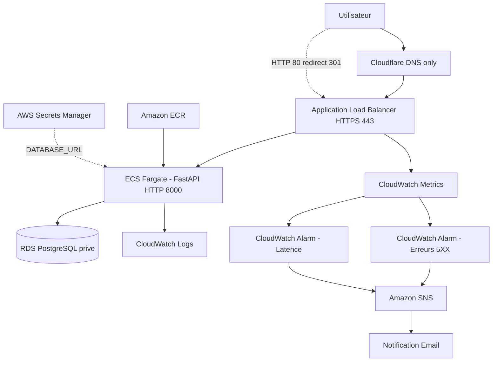

# Cloud Incident Project

Projet portfolio Cloud/DevOps orienté observabilité : API conteneurisée sur AWS, détection d’incidents applicatifs simulés et alertes par e-mail.

Développé dans une logique d’apprentissage pratique (Cloud, DevOps, sécurité), avec infrastructure as code et documentation du débogage réel. **Ce n’est pas une plateforme production-ready** : pas de WAF ni TLS end-to-end jusqu’à ECS, `db_password` encore requis dans `terraform.tfvars` pour créer RDS et le secret Secrets Manager (mais plus injecté en clair dans la task ECS), sécurité IaC Checkov en mode avertissement (non bloquant pour l’instant).

---

## Aperçu

Objectifs du projet :

- Déployer une API conteneurisée sur AWS (environnement **dev**)
- Infrastructure modulaire Terraform
- Simuler des erreurs et de la latence pour tester l’alerting
- Documenter troubleshooting, runbooks et post-mortems

---

## État actuel validé

### Infrastructure

- Terraform modulaire (`infra/modules/`, `infra/envs/dev/`, bootstrap S3/DynamoDB)
- VPC (subnets publics / privés, routage)
- Amazon ECR
- ECS Fargate + Application Load Balancer
- **HTTPS** sur l’ALB (ACM, port 443) + redirection HTTP → HTTPS
- Domaine public : `https://incident.gojakcloud.dev` (DNS Cloudflare → ALB, mode **DNS only**)
- RDS PostgreSQL **privé** (subnets privés, `publicly_accessible = false`)
- AWS Secrets Manager (`DATABASE_URL` injectée dans ECS via `secrets`, pas en clair dans `environment`)
- CloudWatch Logs
- CloudWatch Alarms (5XX, latence)
- SNS (notification e-mail)

### CI/CD

- GitHub Actions (qualité Python, build, Trivy)
- Terraform CI (`fmt`, `validate`, `tflint`, `checkov` en warning)
- Push automatique image → ECR (branche `main`)
- Redéploiement ECS (`update-service --force-new-deployment`)
- Scan Trivy (CRITICAL en avertissement temporaire, HIGH en avertissement)
- Authentification AWS via OIDC
- Validation post-déploiement ECS (`wait services-stable` + smoke test HTTPS `/health` bloquant)
- ECS deployment circuit breaker (rollback automatique)

### Application & local

- API FastAPI
- Docker + Docker Compose (API + PostgreSQL en local)
- Docker hardening : utilisateur non-root (`appuser`) + `HEALTHCHECK` sur `/health`
- Tests Pytest

### Documentation

- Architecture (`docs/architecture.md`)
- Journal de debug (`docs/debug-journal.md`)
- Runbook incident 5XX (`docs/runbook-incident-5xx.md`)
- Post-mortem exemple (`docs/postmortem-example.md`)
- Estimation des coûts (`docs/cost-estimation.md`)
- Captures de validation incident → alarme → e-mail (`docs/*.png`)

---

## Architecture



---

## Stack technique

| Catégorie | Technologies |
|---|---|
| Backend | FastAPI |
| Conteneurisation | Docker, Docker Compose |
| Tests | Pytest |
| Infrastructure as Code | Terraform |
| Cloud Provider | AWS |
| Registry | Amazon ECR |
| Compute | ECS Fargate |
| Base de données | RDS PostgreSQL (privé, dev) |
| Secrets | AWS Secrets Manager (`DATABASE_URL` → ECS) |
| TLS | ACM (certificat sur l’ALB, région `eu-west-3`) |
| DNS | Cloudflare (`incident.gojakcloud.dev` → ALB, DNS only) |
| Réseau | VPC + ALB |
| Monitoring | CloudWatch Logs, CloudWatch Alarms |
| Notifications | SNS (e-mail) |
| CI/CD | GitHub Actions, Trivy, Terraform CI (TFLint, Checkov) |

---

## Fonctionnalités actuelles

### API

Endpoints principaux :

```http
GET  /health
GET  /api/orders
POST /api/orders
GET  /api/error
GET  /api/slow
```

| Route | Rôle |
|---|---|
| `/health` | Santé pour ALB / tests (`{"status":"ok"}`) |
| `/api/orders` | CRUD commandes (démo métier) |
| `/api/error` | Erreur HTTP 500 simulée (tests alerting) |
| `/api/slow` | Latence ~5 s simulée (tests alerting) |

**Données :** **PostgreSQL** en local (Docker Compose) et sur AWS (RDS privé, base `orders`). Accès RDS limité au security group des tâches ECS (port 5432 uniquement).

**Accès cloud :** `https://incident.gojakcloud.dev` (TLS terminé à l’ALB ; trafic ALB → ECS en HTTP interne sur le port 8000).

---

### Infrastructure AWS (dev)

Déployée via Terraform (`infra/envs/dev/`) :

- VPC, subnets publics/privés, routage
- ECS Fargate, ALB, target group, health checks
- **HTTPS** : listener 443 (ACM), listener 80 → redirect 301 vers HTTPS
- Variable Terraform `acm_certificate_arn` (certificat `*.gojakcloud.dev`, même région que l’ALB)
- RDS PostgreSQL (`infra/modules/rds/`), subnet group privé, SG dédié
- Secrets Manager : secret `cloudops-incident-dev-database-url` (URL PostgreSQL complète)
- ECS : `DATABASE_URL` via bloc `secrets` (ARN Secrets Manager), rôle **execution** avec `GetSecretValue` ciblé
- ECR, rôles IAM (execution / task)
- CloudWatch Logs, CloudWatch Alarms, SNS e-mail

**Credentials RDS :**

- `db_password` (sensible) dans `terraform.tfvars` (non versionné) : sert à **créer** l’instance RDS et la **version** du secret Secrets Manager.
- La task definition ECS ne contient **plus** le mot de passe en clair dans `environment`.
- Output Terraform : `database_secret_arn` (ARN uniquement, jamais la valeur du secret).

Bootstrap Terraform state : `infra/bootstrap/`.

---

### Observabilité

Métriques ALB surveillées :

- taux d’erreurs HTTP 5XX
- temps de réponse (latence)

Alertes configurées → SNS → e-mail.

---

### Validation réelle

Tests manuels documentés :

- Déploiement ECS et health checks ALB
- API via domaine : `https://incident.gojakcloud.dev/health` → `{"status":"ok"}`
- Redirection HTTP → HTTPS (`curl -I http://incident.gojakcloud.dev/health` → 301)
- `/api/orders` → persistance RDS (via `DATABASE_URL` depuis Secrets Manager)
- Simulation 5XX et latence
- Alarme CloudWatch → état ALARM → e-mail SNS
- Logs CloudWatch
- Cycle `terraform destroy` (avec attention aux dépendances)

Chaîne validée :

```text
GET /api/error
→ ALB : réponses HTTP 500
→ CloudWatch : métrique 5XX
→ Alarme : ALARM
→ SNS : notification e-mail
```

#### 1. Simulation des erreurs HTTP 500


#### 2. Alarme CloudWatch déclenchée


#### 3. Alerte e-mail reçue via SNS


---

## Structure du projet

```text
Cloud-Incident-Projet/
│
├── app/
│   ├── main.py
│   ├── models.py
│   ├── schemas.py
│   ├── database.py
│   └── config.py
│
├── tests/
│
├── docs/
│   ├── architecture.md
│   ├── debug-journal.md
│   ├── runbook-incident-5xx.md
│   ├── postmortem-example.md
│   ├── cost-estimation.md
│   └── *.png
│
├── infra/
│   ├── bootstrap/
│   ├── envs/dev/
│   └── modules/
│       ├── vpc/
│       ├── ecr/
│       ├── ecs/
│       ├── rds/
│       └── monitoring/
│
├── Dockerfile
├── docker-compose.yml
├── requirements.txt
├── requirements-dev.txt
└── .github/workflows/
    ├── ci.yml
    └── terraform.yml
```

---

## Documentation

| Document | Description |
|---|---|
| [docs/architecture.md](docs/architecture.md) | Architecture détaillée |
| [docs/debug-journal.md](docs/debug-journal.md) | Problèmes rencontrés et résolutions |
| [docs/runbook-incident-5xx.md](docs/runbook-incident-5xx.md) | Procédure de gestion d’incident 5XX |
| [docs/postmortem-example.md](docs/postmortem-example.md) | Post-mortem — ECS TaskFailedToStart (image ECR absente) |
| [docs/cost-estimation.md](docs/cost-estimation.md) | Estimation des coûts AWS (dev, eu-west-3) |
| `docs/*.png` | Captures de validation (incident, alarme, e-mail) |

---

## Exécution locale

```bash
git clone https://github.com/labosnie/Cloud-Incident-Projet.git
cd Cloud-Incident-Projet
docker compose up --build
```

```bash
curl http://localhost:8000/health
# {"status":"ok"}
```

> Utiliser `docker compose up --build` (API + PostgreSQL). Un `docker run` seul tente PostgreSQL sur `localhost` et échoue sans service `db`.

Vérifier le hardening local :

```bash
docker ps
# colonne STATUS : healthy (HEALTHCHECK /health)
```

Tests unitaires :

```bash
pip install -r requirements-dev.txt
pytest -v
```

---

## CI/CD

Pipelines GitHub Actions :

- [`.github/workflows/ci.yml`](.github/workflows/ci.yml) pour API/Docker/Trivy/CD ECS
- [`.github/workflows/terraform.yml`](.github/workflows/terraform.yml) pour la qualité/sécurité Terraform

### Sur chaque push et pull request

```text
Checkout → Python 3.13 → pip install
        ↓
flake8 → black --check → pytest → docker build → Trivy (CRITICAL / HIGH)
```

| Étape | Détail |
|---|---|
| Lint / format | flake8, black --check |
| Tests | Pytest |
| Build | Image `cloudops-incident-api:ci` |
| Trivy CRITICAL | Avertissement temporaire (non bloquant pendant fiabilisation ECS) |
| Trivy HIGH | Affiché en avertissement, pipeline **vert** |

### Sur push vers `main` uniquement

```text
Connexion AWS (OIDC role-to-assume) → login ECR → push :latest + :sha
        ↓
ecs update-service --force-new-deployment
        ↓
ecs wait services-stable
        ↓
describe-services
        ↓
smoke test bloquant GET /health en HTTPS (via ALB + hostname incident.gojakcloud.dev)
```

Secrets GitHub requis : `AWS_ROLE_ARN`, `AWS_REGION`, `ECR_REPOSITORY`, `ECS_CLUSTER`, `ECS_SERVICE`.

> **Non implémenté :** `terraform apply` en CI.

Test manuel HTTPS :

```powershell
curl.exe -I http://incident.gojakcloud.dev/health
curl.exe https://incident.gojakcloud.dev/health
```

### Terraform CI (fmt / validate / tflint / checkov)

Pipeline dédié : [`.github/workflows/terraform.yml`](.github/workflows/terraform.yml).

Exécutions automatiques :

- `terraform fmt -check -recursive infra/`
- `terraform init -backend=false` + `terraform validate` sur `infra/bootstrap`
- `terraform init -backend=false` + `terraform validate` sur `infra/envs/dev`
- `tflint` sur `infra/bootstrap` et `infra/envs/dev` (configuration `infra/.tflint.hcl`)
- `checkov` sur `infra/` en mode **warning** (`soft_fail: true`)

### Scan Trivy en local

```powershell
docker build -t cloudops-incident-api:local .
trivy image --severity CRITICAL --exit-code 1 cloudops-incident-api:local
trivy image --severity HIGH cloudops-incident-api:local
```

Runs : [Actions sur GitHub](https://github.com/labosnie/Cloud-Incident-Projet/actions).

### Fiabilisation du déploiement ECS

- Déploiement validé par état réel (`aws ecs wait services-stable`) et non par délai fixe.
- Smoke test bloquant sur `GET /health` en **HTTPS** (`curl --connect-to` vers l’ALB avec le hostname du certificat ACM).
- Circuit breaker ECS activé avec rollback automatique en cas de déploiement unhealthy.

### Docker hardening (niveau 1)

- **Utilisateur non-root** : l’API tourne sous `appuser` (moindre privilège).
- **HEALTHCHECK** : probe Docker sur `GET /health` (utile en local via `docker ps`).
- **ECS/ALB** : le health check de production reste celui du target group ALB (`/health`), complémentaire au HEALTHCHECK image.

---

## Roadmap

### Réalisé

- [x] API FastAPI, Docker, Docker Compose, Pytest
- [x] Terraform modulaire (VPC, ECR, ECS, ALB, monitoring)
- [x] CloudWatch Logs / Alarms, SNS e-mail
- [x] GitHub Actions : qualité, Trivy, push ECR, redéploiement ECS
- [x] Validation post-déploiement ECS : `services-stable` + smoke test `/health` bloquant
- [x] ECS deployment circuit breaker avec rollback automatique
- [x] Terraform CI : `terraform fmt`, `terraform validate`, `tflint`, `checkov` (warning)
- [x] Docker hardening : utilisateur non-root + `HEALTHCHECK` `/health`
- [x] RDS PostgreSQL privé (module Terraform, persistance cloud sur ECS)
- [x] AWS Secrets Manager : injection `DATABASE_URL` dans ECS (hors task definition en clair)
- [x] HTTPS sur l’ALB avec certificat ACM + redirection HTTP → HTTPS (`incident.gojakcloud.dev`)
- [x] Documentation (architecture, debug journal, runbook, post-mortem, coûts)

### Priorité haute

- [x] GitHub Actions → AWS **OIDC** (remplacer les clés longues durée)
- [ ] Durcir Checkov (certaines règles critiques en bloquant)

### Priorité moyenne

- [ ] Repasser Trivy CRITICAL en mode bloquant après correction des CVE image

### Priorité future

- [ ] Rotation automatique du secret RDS / Secrets Manager
- [ ] Dashboard CloudWatch
- [ ] OpenTelemetry / tracing distribué
- [ ] Environnements séparés (staging / production)
- [ ] WAF

---

## Leçons apprises

Problèmes rencontrés durant le développement :

- Différence entre ECS et ECR
- Gestion des images Docker privées
- Diagnostic d’erreurs ALB 503
- Importance des health checks
- Débogage CloudWatch et métriques ALB
- Dépendances Terraform au `destroy`
- Après `terraform apply`, pousser l’image ECR avant qu’ECS puisse démarrer
- `DATABASE_URL` via Secrets Manager : permission `GetSecretValue` sur le rôle ECS **execution**, pas le task role
- Versions PostgreSQL RDS : vérifier la dispo par région (`aws rds describe-db-engine-versions`)
- HTTPS / ACM : certificat dans la même région que l’ALB ; éviter de remplacer un Security Group pour ajouter le port 443
- Intérêt de documenter incidents et post-mortems

Détails : [docs/debug-journal.md](docs/debug-journal.md).

---

## Licence

Ce projet est sous licence [MIT](LICENSE).

---

## Auteur

Projet portfolio — montée en compétences Cloud / DevOps / sécurité, avec une architecture réaliste documentée et itérative.
