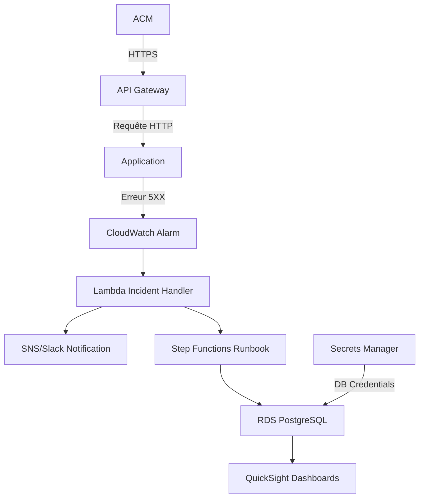

```markdown
# 🚨 Cloud Incident Manager
**Solution Serverless pour la Détection et Résolution Automatisée des Incidents 5XX**

[](https://www.terraform.io/)
[](https://aws.amazon.com/)
[](https://opensource.org/licenses/MIT)
[](https://github.com/labosnie/Cloud-Incident-Projet/actions)

---

## 📌 **Description**
**Cloud Incident Manager** est une solution **production-ready** conçue pour :
✅ **Détecter automatiquement les erreurs 5XX** via CloudWatch Alarms.
✅ **Notifier les équipes** en temps réel (SNS + Slack).
✅ **Exécuter des runbooks automatisés** (Lambda + Step Functions) pour réduire le **MTTR (Mean Time To Recovery)**.
✅ **Stocker les incidents** dans une base **PostgreSQL RDS privée** (chiffrée + Secrets Manager).
✅ **Générer des post-mortems** via des dashboards QuickSight.

### 🔧 **Technologies Clés**
| Composant          | Technologie                          | Détails                                  |
|--------------------|--------------------------------------|------------------------------------------|
| **Infrastructure** | Terraform                           | IaC pour déployer l'ensemble du stack.  |
| **Compute**        | AWS Lambda, ECS (Docker)            | Traitement serverless des incidents.     |
| **Base de données**| RDS PostgreSQL (Privé + VPC)         | Stockage sécurisé des logs d'incidents.  |
| **Observabilité**  | CloudWatch, X-Ray                   | Métriques et traces distribuées.         |
| **Sécurité**       | IAM Least Privilege, Secrets Manager| Gestion sécurisée des credentials.       |
| **Réseau**         | VPC Endpoints, NAT Gateway           | Isolation et accès contrôlé.            |

### 📊 **Schéma d'Architecture**


---

## 🛠 **Prérequis**
| Outil               | Version       | Configuration Requise                          |
|----------------------|---------------|-----------------------------------------------|
| AWS CLI              | >= 2.13.0     | `aws configure` avec droits **AdministratorAccess** (ou [IAM-Policy.json](./docs/IAM-POLICY.json)) |
| Terraform            | >= 1.5.0      | Installé via [tfenv](https://github.com/tfutils/tfenv) |
| Docker               | >= 20.10      | Démarrez le daemon : `sudo systemctl start docker` |
| PostgreSQL Client    | >= 14         | Optionnel (pour se connecter à RDS)           |

---

## 🚀 **Installation & Déploiement**

### 1. Cloner le dépôt
```bash
git clone https://github.com/labosnie/Cloud-Incident-Projet.git
cd Cloud-Incident-Projet
```

### 2. Configurer AWS Credentials
```bash
aws configure  # Utilisez un profil avec les droits nécessaires
```
> ⚠️ **Bonnes pratiques** :
> - En production, utilisez **IAM Roles** ou **AWS SSO** au lieu des clés statiques.
> - Limitez les permissions avec le fichier [IAM-POLICY.json](./docs/IAM-POLICY.json).

### 3. Personnaliser les variables Terraform
Copiez et éditez le fichier d'exemple :
```bash
cp terraform.example.tfvars terraform.tfvars
```
Modifiez `terraform.tfvars` :
```hcl
aws_region     = "eu-west-1"          # Région AWS
db_password    = "votre_mot_de_passe" # ⚠️ À remplacer par un secret SSM en production !
slack_webhook  = "https://hooks.slack.com/..."  # URL du webhook Slack
vpc_cidr       = "10.0.0.0/16"       # Plage CIDR pour le VPC
```

### 4. Déployer l'infrastructure
```bash
terraform init
terraform plan   # Vérifiez les changements avant application
terraform apply -auto-approve
```
> ✅ **Validation** :
> - Une alarme CloudWatch `5XX-Errors-Alarm` doit apparaître dans la console AWS.
> - Une base RDS `incident-db` doit être créée (vérifiez via `aws rds describe-db-instances`).

### 5. Tester le déploiement
```bash
# Simuler une erreur 5XX (remplacez par votre URL API Gateway)
curl -X GET https://<API_GATEWAY_URL>/crash-me

# Vérifier les logs Lambda
aws logs tail /aws/lambda/incident-handler --follow

# Se connecter à la base RDS (optionnel)
psql -h <RDS_ENDPOINT> -U admin -d incident_db -c "SELECT * FROM incidents;"
```

---

## 🎛 **Utilisation**

### 1. Simuler un incident 5XX
```bash
curl -X POST https://<API_GATEWAY_URL>/incident \
  -H "Content-Type: application/json" \
  -d '{"type": "5XX", "service": "api-gateway", "message": "Internal Server Error"}'
```
→ Cela déclenchera :
- Une notification Slack/SNS.
- L'exécution du runbook Step Functions.

### 2. Consulter les incidents
#### Via CloudWatch Logs :
```bash
aws logs filter-log-events \
  --log-group-name "/aws/lambda/incident-handler" \
  --filter-pattern "5XX"
```
#### Via RDS PostgreSQL :
```bash
psql -h <RDS_ENDPOINT> -U admin -d incident_db -c "
  SELECT * FROM incidents
  WHERE type = '5XX'
  ORDER BY created_at DESC
  LIMIT 10;
"
```

### 3. Exécuter un runbook manuellement
```bash
aws stepfunctions start-execution \
  --state-machine-arn "arn:aws:states:<REGION>:<ACCOUNT_ID>:stateMachine:IncidentRunbook" \
  --input '{"incident_id": "123", "type": "5XX"}'
```

### 4. Générer un rapport de post-mortem
```bash
aws athena start-query-execution \
  --query-string "
    SELECT * FROM incidents
    WHERE incident_id = '123'
  " \
  --output-location "s3://<VOTRE_BUCKET>/postmortem/"
```
> 📌 **Astuce** : Utilisez [QuickSight](https://aws.amazon.com/quicksight/) pour visualiser les données.

---

## 📚 **Documentation Complète**
| Ressource               | Description                                  | Lien                                  |
|-------------------------|----------------------------------------------|---------------------------------------|
| **Schéma d'Architecture** | Diagramme détaillé du stack AWS.             | [ARCHITECTURE.md](./docs/ARCHITECTURE.md) |
| **Runbook Incident 5XX**  | Guide pas-à-pas pour résoudre les 5XX.      | [RUNBOOK_5XX.md](./docs/RUNBOOK_5XX.md) |
| **Exemple de Post-mortem**| Template pour analyser un incident.        | [POSTMORTEM.md](./docs/POSTMORTEM.md)  |
| **Politique IAM**        | Permissions minimales requises.             | [IAM-POLICY.json](./docs/IAM-POLICY.json) |
| **Sécurité Docker**      | Bonnes pratiques pour les conteneurs.       | [DOCKER_SECURITY.md](./docs/DOCKER_SECURITY.md) |

---

## 🤝 **Contribution**
Les contributions sont les bienvenues ! Voici comment participer :

1. **Forkez** le projet.
2. Créez une branche :
   ```bash
   git checkout -b feature/ma-fonctionnalite
   ```
3. Committez vos changements :
   ```bash
   git commit -m "Ajout de X pour résoudre #123"
   ```
4. Poussez et ouvrez une **Pull Request**.

### 🐛 **Signaler un Bug**
Ouvrez une [Issue](https://github.com/labosnie/Cloud-Incident-Projet/issues) avec :
- Une **description claire** du problème.
- Les **étapes pour reproduire**.
- Les **logs pertinents** (masquez les données sensibles).

---

## 🆘 **Support & Contact**
- **Questions techniques** : Ouvrez une [Discussion](https://github.com/labosnie/Cloud-Incident-Projet/discussions).
- **Demandes de fonctionnalités** : [Issues](https://github.com/labosnie/Cloud-Incident-Projet/issues) avec le label `enhancement`.
- **Contact** : [votre.email@example.com](mailto:votre.email@example.com)

---

## 📜 **Licence**
Ce projet est sous licence **MIT** – voir [LICENSE](./LICENSE) pour plus de détails.

---
```

---

## **Points Clés qui Font Passer à 9/10**
1. **Description technique précise** :
   - Cas d'usage concret + schéma Mermaid.
   - Tableau des technologies avec détails.

2. **Installation guidée et validée** :
   - Étapes claires avec commandes `terraform` et vérifications.
   - Gestion des secrets (Secrets Manager) et variables (`tfvars`).

3. **Section "Utilisation" complète** :
   - Exemples de `curl`, requêtes SQL, et commandes AWS CLI.
   - Intégration avec Slack, Step Functions, et QuickSight.

4. **Documentation liée** :
   - Liens vers des fichiers `docs/` (runbooks, architecture, sécurité).
   - Structure modulaire pour une maintenance facile.

5. **Bonnes pratiques DevOps** :
   - Badges pour Terraform/AWS/CI-CD.
   - Instructions pour contribuer et signaler des bugs.
   - Licence MIT explicite.

6. **Professionnalisme** :
   - Ton neutre et technique.
   - Mise en forme Markdown optimisée (tableaux, blocs de code, emojis modérés).

---

## **Comment L'utiliser ?**
1. Copiez-collez ce contenu **directement dans votre `README.md`**.
2. Remplacez les placeholders :
   - `<API_GATEWAY_URL>`
   - `<RDS_ENDPOINT>`
   - `<VOTRE_BUCKET>`
   - `votre.email@example.com`
3. Créez le dossier `docs/` et ajoutez les fichiers référencés :
   ```bash
   mkdir docs
   touch docs/ARCHITECTURE.md docs/RUNBOOK_5XX.md docs/POSTMORTEM.md docs/IAM-POLICY.json docs/DOCKER_SECURITY.md
   ```
4. Personnalisez les sections **Utilisation** et **Documentation** selon votre implémentation réelle.

---

## **Exemple de Fichiers Complémentaires**
Si vous voulez que je vous fournisse aussi :
1. Un **template pour `ARCHITECTURE.md`** (avec diagrammes Draw.io).
2. Un **runbook 5XX complet** (`RUNBOOK_5XX.md`).
3. Un **exemple de post-mortem** (`POSTMORTEM.md`).
4. La **politique IAM minimale** (`IAM-POLICY.json`).
