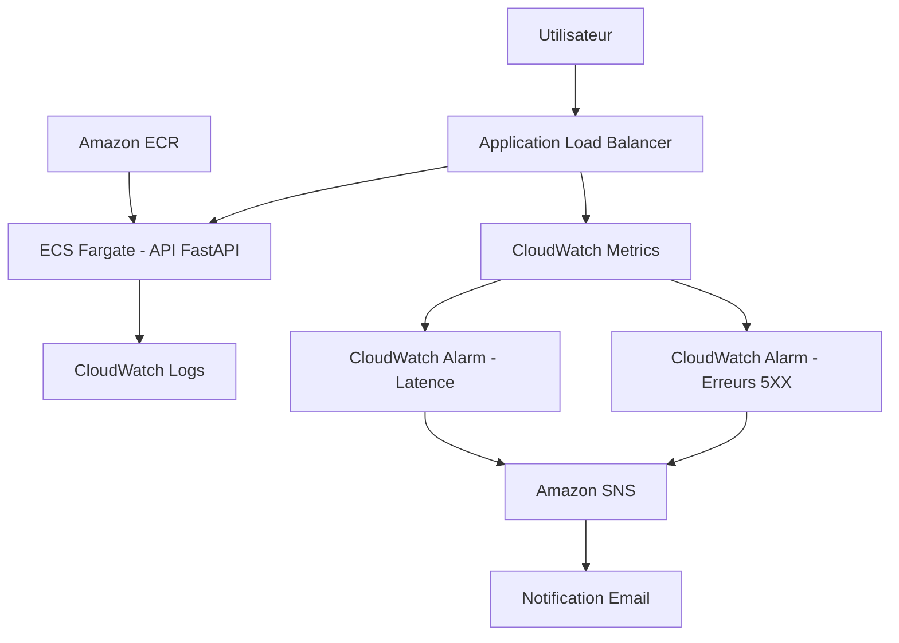

# Architecture — Cloud Incident Project

## Objectif

Cloud Incident Project est un projet Cloud / DevOps / Sécurité orienté observabilité et gestion d’incidents.

L’objectif actuel est de déployer une API FastAPI conteneurisée sur AWS, de l’exposer via un Application Load Balancer, puis de surveiller automatiquement les erreurs applicatives grâce à CloudWatch et SNS.

Cette architecture est une version de démonstration pensée pour l’apprentissage, le portfolio et la pratique des fondamentaux Cloud/DevOps.

Elle n’est pas présentée comme une architecture de production complète.

---

## Vue d’ensemble



---

## Composants principaux

| Composant | Rôle |
|---|---|
| FastAPI | API applicative utilisée pour simuler des scénarios normaux, lents ou en erreur |
| Docker | Conteneurisation de l’application |
| Amazon ECR | Stockage privé de l’image Docker |
| Amazon ECS Fargate | Exécution de l’application conteneurisée sans gestion de serveur |
| Application Load Balancer | Point d’entrée HTTP public vers l’application |
| CloudWatch Logs | Centralisation des logs de l’application |
| CloudWatch Metrics | Collecte des métriques ALB utilisées pour l’alerting |
| CloudWatch Alarms | Détection automatique des erreurs 5XX et de la latence |
| Amazon SNS | Envoi des notifications email lors d’un incident |
| Terraform | Déploiement et gestion de l’infrastructure AWS |
| VPC | Isolation réseau de l’infrastructure |

---

## Architecture réseau

L’architecture actuelle est volontairement simple afin de limiter les coûts et faciliter l’apprentissage.

```text
VPC
│
├── Subnet public A
│   └── Application Load Balancer
│
├── Subnet public B
│   └── ECS Fargate Task
│
└── Internet Gateway
```

### Choix actuel

Les tâches ECS Fargate sont actuellement déployées dans des subnets publics avec une IP publique.

Ce choix est assumé pour une version de démonstration low-cost, car il évite l’utilisation d’une NAT Gateway, qui représente un coût fixe supplémentaire.

### Limite de ce choix

Ce n’est pas l’architecture cible pour une production.

Une architecture plus propre consisterait à placer :

```text
ALB
→ subnets publics

ECS Fargate
→ subnets privés

RDS
→ subnets privés

Sortie Internet contrôlée
→ NAT Gateway ou VPC Endpoints
```

---

## Flux applicatif

Exemple avec un appel HTTP classique :

```text
Utilisateur
→ Application Load Balancer
→ ECS Fargate
→ API FastAPI
→ Réponse HTTP
```

L’ALB reçoit la requête, la transmet à une task ECS Fargate, puis retourne la réponse de l’application au client.

Le health check de l’ALB utilise l’endpoint :

```http
GET /health
```

Résultat attendu :

```json
{"status":"ok"}
```

---

## Flux de détection d’incident

Le projet permet de simuler deux types de problèmes applicatifs.

### Simulation d’erreur serveur

Endpoint utilisé :

```http
GET /api/error
```

Objectif :

```text
Simuler une erreur HTTP 500
```

Flux associé :

```text
/api/error
→ réponse HTTP 500
→ métrique ALB HTTPCode_Target_5XX_Count
→ CloudWatch Alarm
→ SNS
→ email d’alerte
```

### Simulation de latence

Endpoint utilisé :

```http
GET /api/slow
```

Objectif :

```text
Simuler un temps de réponse élevé
```

Flux associé :

```text
/api/slow
→ réponse lente
→ métrique ALB TargetResponseTime
→ CloudWatch Alarm
→ SNS
→ email d’alerte
```

---

## Observabilité

L’observabilité actuelle repose sur trois éléments.

### Logs

Les logs de l’application ECS sont envoyés vers CloudWatch Logs.

Log group utilisé :

```text
/ecs/cloudops-incident-dev/api
```

Utilité :

- vérifier le comportement de l’application ;
- diagnostiquer un crash applicatif ;
- analyser les erreurs FastAPI/Uvicorn ;
- corréler les incidents avec les requêtes.

### Métriques

Les métriques principales viennent de l’Application Load Balancer.

Métriques utilisées :

```text
HTTPCode_Target_5XX_Count
TargetResponseTime
```

### Alertes

Deux alarmes CloudWatch sont prévues :

| Alarme | Métrique | Objectif |
|---|---|---|
| 5XX Alarm | HTTPCode_Target_5XX_Count | Détecter une hausse des erreurs serveur |
| Latency Alarm | TargetResponseTime | Détecter une latence anormale |

Les alarmes déclenchent un topic SNS qui envoie une notification email.

---

## Infrastructure as Code

L’infrastructure est gérée avec Terraform.

Structure actuelle :

```text
infra/
├── bootstrap/
├── envs/
│   └── dev/
└── modules/
    ├── vpc/
    ├── ecr/
    ├── ecs/
    └── monitoring/
```

### Modules Terraform

| Module | Responsabilité |
|---|---|
| vpc | Création du réseau AWS, subnets et routage |
| ecr | Création du repository Docker privé |
| ecs | Déploiement ECS Fargate, ALB, Target Group et logs |
| monitoring | Création des alarmes CloudWatch et du topic SNS |

Cette séparation permet de rendre l’infrastructure plus lisible, maintenable et évolutive.

---

## Sécurité actuelle

### Mesures déjà présentes

| Élément | État |
|---|---|
| VPC dédié | Présent |
| Security Groups | Présents |
| ECR privé | Présent |
| IAM roles ECS | Présents |
| CloudWatch Logs | Présent |
| Pas de secret commité | Objectif appliqué via `.gitignore` |
| Destruction de l’infrastructure après test | Utilisé pour limiter les coûts et l’exposition |

### Points à améliorer

| Amélioration | Objectif |
|---|---|
| HTTPS avec ACM | Chiffrer le trafic entre client et ALB |
| Secrets Manager ou SSM | Gérer proprement les secrets applicatifs |
| ECS en subnets privés | Réduire l’exposition réseau |
| VPC Endpoints ou NAT Gateway | Contrôler les accès sortants |
| IAM least privilege | Réduire les permissions au strict nécessaire |
| Docker non-root | Réduire l’impact d’une compromission du container |
| Trivy | Scanner les vulnérabilités de l’image Docker |
| WAF | Ajouter une protection applicative devant l’ALB |

---

## Gestion des coûts

L’architecture actuelle est pensée pour rester contrôlable financièrement.

Choix appliqués :

- pas de RDS pour l’instant ;
- pas de NAT Gateway pour l’instant ;
- ECS Fargate avec petite configuration ;
- CloudWatch Logs avec rétention courte ;
- destruction de l’infrastructure après les tests ;
- ECR configuré pour permettre le nettoyage en environnement dev.

Commande utilisée pour supprimer l’infrastructure :

```powershell
terraform destroy
```

---

## Limites actuelles

Cette architecture reste une version d’apprentissage.

Limites connues :

- pas de HTTPS ;
- pas de base RDS managée ;
- pas de Secrets Manager ;
- pas de CI/CD de déploiement complet ;
- pas encore de rollback automatisé ;
- pas encore de dashboard CloudWatch complet ;
- pas encore de tracing distribué ;
- pas encore d’environnement staging/prod séparé ;
- ECS actuellement exposé en subnet public pour éviter la NAT Gateway.

---

## Architecture cible future

À terme, l’architecture pourrait évoluer vers :

```text
Utilisateur
→ Route 53
→ ACM / HTTPS
→ Application Load Balancer public
→ ECS Fargate en subnets privés
→ RDS PostgreSQL en subnets privés
→ Secrets Manager
→ CloudWatch Logs / Metrics / Alarms
→ SNS
→ Runbooks documentés
→ CI/CD GitHub Actions
```

Améliorations futures :

- HTTPS avec ACM ;
- RDS PostgreSQL privé ;
- Secrets Manager ;
- GitHub Actions CI/CD ;
- Trivy image scanning ;
- WAF ;
- dashboard CloudWatch ;
- OpenTelemetry ;
- séparation dev/staging/prod.

---

## Leçons apprises

Cette architecture a permis de travailler sur des problèmes concrets :

- différence entre ECR et ECS ;
- diagnostic d’un ALB en erreur 503 ;
- rôle des health checks ;
- nécessité de pousser l’image Docker dans ECR avant le déploiement ECS ;
- importance des dimensions CloudWatch pour les métriques ALB ;
- test réel d’une chaîne d’alerte CloudWatch vers SNS ;
- gestion des dépendances Terraform lors d’un destroy ;
- importance d’un debug journal dans un projet Cloud/DevOps.

---

## Conclusion

Cette architecture constitue une première base Cloud/DevOps fonctionnelle.

Elle démontre :

- le déploiement d’une API conteneurisée sur AWS ;
- l’exposition via un Load Balancer ;
- l’observabilité avec CloudWatch ;
- la détection d’incidents ;
- la notification via SNS ;
- la documentation du troubleshooting.

La prochaine évolution logique est d’ajouter une documentation opérationnelle complète avec runbook, post-mortem d’exemple et estimation des coûts, puis d’automatiser progressivement le cycle de livraison avec GitHub Actions.