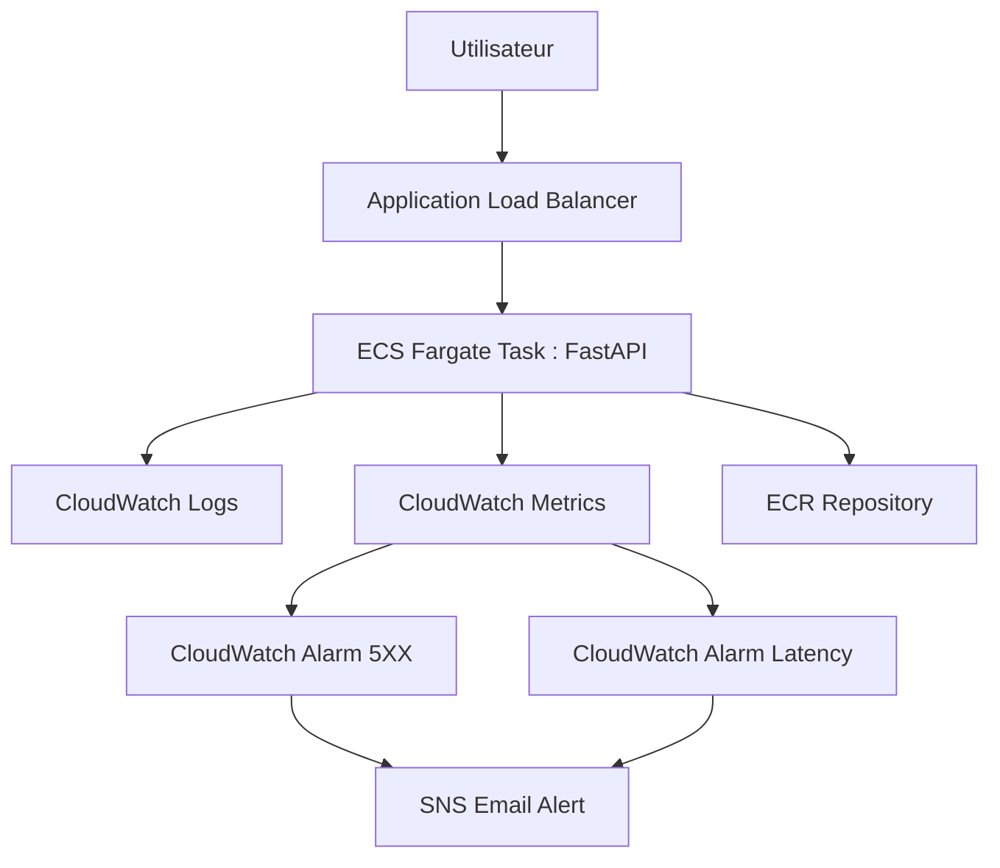

# 🏗 Architecture — Cloud Incident Manager

## 📌 Objectif

Cloud Incident Manager est une plateforme cloud orientée observabilité et gestion d'incidents.

L'objectif actuel du projet est :

- Déployer une API conteneurisée sur AWS
- Surveiller automatiquement les incidents
- Détecter les erreurs applicatives
- Déclencher des alertes
- Faciliter le diagnostic et le troubleshooting

---

# 📊 Architecture actuelle



---

# 🔧 Composants AWS utilisés

| Service | Rôle |
|-----------|------|
| VPC | Isolation réseau de l'infrastructure |
| Public Subnets | Hébergent les ressources accessibles |
| ECS Fargate | Exécution des conteneurs |
| ECR | Stockage privé des images Docker |
| ALB | Distribution du trafic HTTP |
| CloudWatch Logs | Centralisation des logs |
| CloudWatch Alarms | Détection d'incidents |
| SNS | Notifications email |
| Terraform | Infrastructure as Code |

---

# 🌐 Architecture réseau

Actuellement :

```text
VPC
│
├── Public subnet A
│       │
│       └── ALB
│
├── Public subnet B
│       │
│       └── ECS Fargate Tasks
│
└── Internet Gateway
```

Configuration actuelle :

- ALB exposé publiquement
- ECS Fargate dans des subnets publics
- assign_public_ip = true
- Communication vers ECR via Internet Gateway
- Health check :

```text
/health
```

---

# 🔍 Flux de traitement d'une requête

Étape 1 :

Utilisateur :

```text
GET /api/slow
```

↓

Étape 2 :

ALB reçoit la requête

↓

Étape 3 :

ALB redirige vers ECS

↓

Étape 4 :

FastAPI traite la requête

↓

Étape 5 :

CloudWatch collecte :

- métriques
- logs
- erreurs
- temps de réponse

↓

Étape 6 :

CloudWatch Alarm vérifie :

- erreurs 5XX
- latence

↓

Étape 7 :

SNS envoie un email si seuil dépassé

---

# 🚨 Gestion des incidents

Incidents actuellement simulés :

### Endpoint lent

```text
/api/slow
```

Simule :

- temps de réponse élevé

Déclenche :

- alarme de latence

---

### Endpoint erreur

```text
/api/error
```

Simule :

- erreur HTTP 500

Déclenche :

- alarme 5XX

---

# 🔒 État sécurité actuel

Actuellement implémenté :

✅ Security Groups

✅ Isolation VPC

✅ ECR privé

✅ IAM roles ECS

✅ CloudWatch logs centralisés

À améliorer :

⬜ HTTPS + ACM

⬜ WAF

⬜ Secrets Manager

⬜ Least Privilege IAM

⬜ ECS privé + NAT Gateway

⬜ Trivy image scanning

---

# 📈 Évolutions prévues

Roadmap :

- GitHub Actions CI/CD
- RDS PostgreSQL privé
- Secrets Manager
- HTTPS ACM
- WAF
- Observabilité avancée
- OpenTelemetry
- Tracing distribué

---

# 🧠 Leçons apprises

Pendant le développement :

- Différence entre ECS et ECR
- Importance des health checks ALB
- Gestion des images Docker privées
- Débogage des dimensions CloudWatch
- Gestion des dépendances Terraform destroy
- Diagnostic réseau AWS
